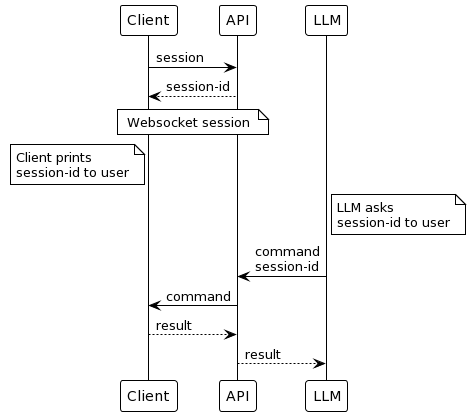

# Server Witch

<p align="center">
  
</p>

Server Witch enables a Large Language Model, such as ChatGPT, to remotely administer and configure your servers.

This project is compatible with the Server Witch custom GPT, available on the [GPT Store](https://chat.openai.com/g/g-htdz15vGv-server-witch).

## Demo


## How to Use

Please read and understand the [Disclaimer](#disclaimer) section before running this on your system.

```
curl -s https://raw.githubusercontent.com/g33kex/ServerWitch/main/run.sh | sh
```

1. This command downloads and runs the executable, which will print a session ID. You can also download the executable from the [releases page](https://github.com/g33kex/ServerWitch/releases/) or built it yourself.
2. Provide this session ID to the Server Witch custom GPT.
3. Ask the GPT to configure your server. Here are some suggestions:
    * Install Apache and set up a test webpage on port 8080.
    * List all installed packages on the server.
    * Determine who is currently connected to the machine.
    * Install Docker and run the Ubuntu image.
    * Audit the SSHD configuration.
    * Reboot the server.
    * Install, deploy Kubernetes, and ensure its proper functionality.

**Before executing each action, the `serverwitch` client will request your confirmation.**

## Disclaimer

This program is essentially a backdoor that enables a remote LLM to control your machine. The permissions granted to the LLM are equivalent to those with which you run the `serverwitch` client. For example, running `sudo serverwitch` grants the LLM full root access to your server.

Allowing an LLM to execute commands on your server can be hazardous, potentially leading to configuration errors, security vulnerabilities, and catastrophic consequences including the potential for AI to take over the world or eat your laundry. We are not liable for any damage resulting from the usage of this software. Exercise extreme caution. Do not use this on production servers.

Furthermore, running this software allows the Server Witch API server to control your machine. The communication between the client and the API is secured with HTTPS, but anyone with access to your session ID can run arbitrary commands on your machine (with your confirmation before each command). If this concerns you, consider deploying your own API server, and restrict its access.

## Privacy Policy

This software is part of a research project on autonomous LLM agents. By using the public API endpoint, you consent to the collection and use for research purposes of your personal data, including commands executed by the LLM, their outputs, and the files read and written, along with their contents. If you prefer to keep your information private, please consider deploying your own Server Witch API endpoint and Server Witch custom GPT. 

## Technical Details

This repository houses the client for Server Witch, an autonomous server configuration assistant. This client enables a Large Language Model, such as ChatGPT, to execute commands on your machine and read/write files with user confirmation.

By default, this client connects to a demo public API server linked to the Server Witch custom GPT. It upgrades its HTTPS connection to a WebSocket to receive commands and send responses.

The witch protocol is illustrated as follows:  

<p align="center">
  
</p>

## Building

To build, first ensure `cargo` and the `rust` toolchain are installed.
Then execute the following commands:
```
git clone https://github.com/g33kex/serverwitch
cd serverwitch
cargo build
```

## Self-Hosting

See [here](https://github.com/g33kex/serverwitch-api) for instructions on how to make your own Server Witch API endpoint and custom GPT.

## Contributing

Contributions are highly appreciated. Please feel free to submit pull requests and bug reports. If you discover a security vulnerability in this software, contact me at `g33kex[at]pm[dot]me`.

